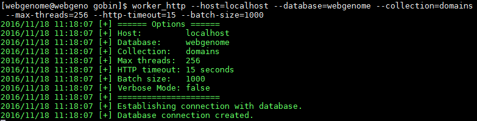
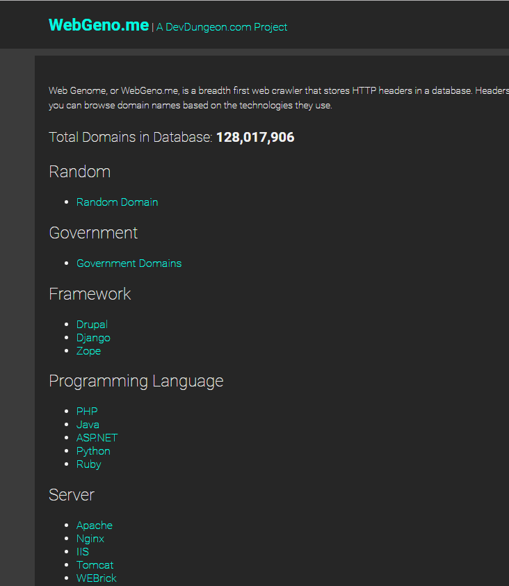

# Web Genome

## Overview

A breadth first web crawler that stores HTTP headers in a MongoDB database with
a web front end all written in Go. www.WebGeno.me is www.DevDungeon.com project.

## Website

* [http://www.webgeno.me](http://www.webgeno.me)
* [DevDungeon.com Web Genome project page](http://www.devdungeon.com/content/web-genome)

## Setup

### Set up the Go environment

Put this in the .bashrc. This is required to run go get, but not for the
systemctl service to function properly.

	export GOPATH=/home/webgenome/gospace
	export GOBIN=/home/webgenome/gobin
	export PATH=$PATH:/opt/go/bin:/home/webgenome/gobin
	export GOROOT=/opt/go

### Get the packages

    go get github.com/DevDungeon/WebGenome
    go get github.com/DevDungeon/WebGenome/core
    go get github.com/DevDungeon/WebGenome/website
    go get github.com/DevDungeon/WebGenome/worker_http
    
    # Or all at once with
    go get github.cm/DevDungeon/WebGenome...
	
### Setting up database

Create a MongoDB database and seed it with a domain.

	mongo
	> use webgenome
	> db.domains.insert({'name':'www.devdungeon.com'})

Add an index on the name field to really speed things up:

	db.domains.createIndex({name:1})

### Run website using systemd

First, due to issues with the static directory being served the executable should
be run in the website directory. Go in to the website dir and run go build to get
an executable in that directory, or copy the one in your $GOBIN to the website dir.
	
	cp /home/webgenome/gospace/src/github.com/DevDungeon/WebGenome/systemctl/webgenome.service /etc/systemd/system/
	chown root:root /usr/lib/systemd/system/webgenome.service
	
	vim /usr/lib/systemd/system/webgenome.service
	
	systemctl webgenome enable
	systemctl webgenome start

### Nginx reverse proxy

The web server will listen on port 3000 by default.
Access it directly or set up a reverse proxy

# /etc/nginx/conf.d/webgenome.conf
	server {
	listen 80;
	server_name webgeno.me;
	return 301 $scheme://www.webgeno.me$request_uri;
	}

	server {
		listen 80;
		server_name www.webgeno.me;
		location / {
			proxy_set_header X-Real-IP $remote_addr;
			proxy_pass http://localhost:3000;
		}
	}

### Running worker_http
	worker_http --host=localhost --database=webgenome --collection=domains --max-threads=4 --http-timeout=30 --batch-size=100 --verbose

## Updating

Only need to go get and restart the service as long as no new Configuration
variables were introduced and nothing needs to change in the systemctl script
(e.g. new cli args introduced)

	# Update the source and executables
    go get -u github.com/DevDungeon/WebGenome
    go get -u github.com/DevDungeon/WebGenome/core
    go get -u github.com/DevDungeon/WebGenome/website
    go get -u github.com/DevDungeon/WebGenome/worker_http
		
	# If necessary, edit the systemctl script
	vim /usr/lib/systemd/system/webgenome.service
	
	# Restart the service
	systemctl restart webgenome

## Source Code
* [WebGenome (GitHub.com)](https://www.github.com/DevDungeon/WebGenome)

## Contact

NanoDano nanodano@devdungeon.com

## License

GNU GPL v2. See LICENSE.txt.

## Notes

You can kill the http_worker at any time and restart it without causing any problems.
If you run multiple instances of the worker at the same time it will end up checking
a lot of the domains multiple times. If you want to crawl more just increase the
number of threads to the worker. I was able to run it with 256 threads on a small
Linode computer.

The website has a hard-coded static directory currently and should be run with
the current working directory of website/. There are multiple database connections
also hard-coded in the website.go file. Yeah, yeah... it needs to be refactored
and dried up.

The worker is not run as a service because it may fill up your disk space.

## Changelog

v1.0 - 2016/11/18 - Initial stable release

## Screenshots

